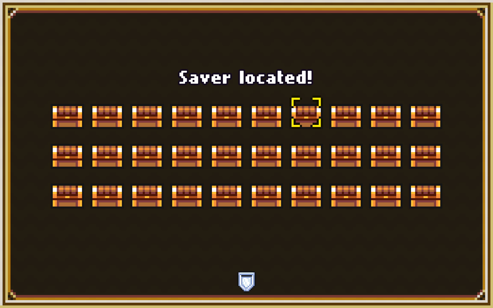

<p align="center">
  
</p>

<h1 align="center">Idle Slayer Auto-Script</h1>
<p align="center">A screen-automation bot that plays the idle game Idle Slayer: it watches the screen, spots events, and clicks them.</p>

<p align="center">
  
  
  
</p>

A Python automation bot for the idle game *Idle Slayer*. It runs a continuous loop that watches the
screen with template/pixel matching, detects in-game events (chest hunts, trials), and drives the
mouse to play them out with `pyautogui`, while cycling movement abilities to keep collecting boxes.
A personal project in computer-vision-driven screen automation: state detection, template matching,
and input synthesis against a live game.

## ✨ Features
- **Chest-hunt automation** — detects when a chest hunt starts, locates every chest by image matching, and clicks them in order (including the special "saver" chest).
- **Trial automation** — spots a trial prompt, starts it, and runs a recorded input sequence.
- **Cycled movement** — keeps high-jump / boost abilities firing to collect boxes; toggled live via `config.json` (`movement`, `high_jump`, `rage`).
- **Event detection by template matching** — reference crops in `imgs/` are matched against the live screen to recognise game state, with no game API needed.
- **Continuous orchestration** — `main.py` runs the polling loop and logs each triggered action.

## 🛠 Stack
Python · pyautogui (input + screen grab) · image template matching · JSON config.

## 🚀 Run
Set the game to **1280×768, borderless** (coordinates are calibrated to that resolution).
```bash
pip install pyautogui pillow opencv-python
python main.py
```
Toggle abilities in `config.json`:
```json
{ "movement": true, "high_jump": true, "rage": true }
```

## 🧠 How it works
`main.py` loops: poll for a chest hunt (`clockChestHunt`) → if found, locate chests
(`chestIdentification`) and click them, handling the saver chest and close button (`saverChest`,
`gameOver`); poll for a trial (`clockTrial`) → start it and replay (`replayscript`). `src/` holds one
module per behaviour; `util/` has the coordinate and colour helpers used to calibrate the templates.

## 🗺 Roadmap
Works against a fixed 1280×768 borderless window.
- [ ] Resolution-independent detection (coordinates are currently hard-coded)
- Known limitation: templates and coordinates are calibrated to one screen layout; a personal automation project for a single game.
